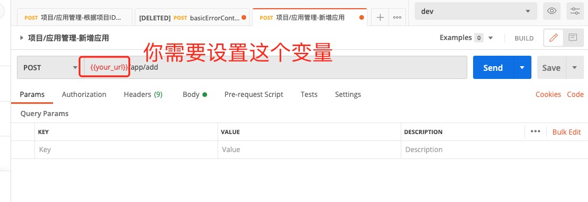
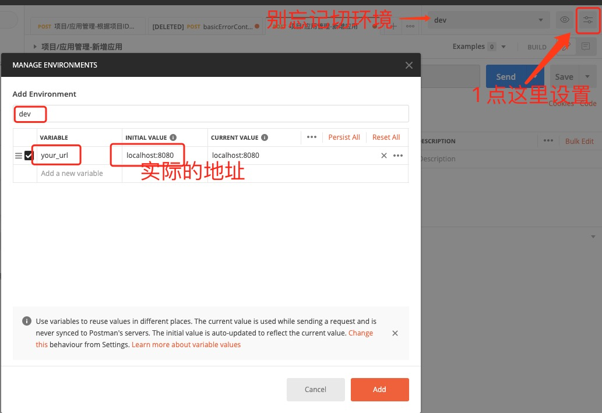
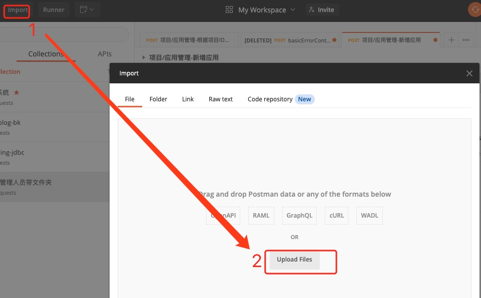

# postman-tool

## 背景
后台开发人员写完接口之后，很多时候会去postman里模拟下接口请求，如果接口很多，
并且入参比较复杂，写这个就很麻烦，偶尔研究了一下postman的导入导出，发现可以用
工具来做，所以诞生了这个工具。
这个工具可以一键生成postman的文件，导入之后，就是你项目的所有的接口请求。

## 使用方法

前提是你的项目使用了spring boot和swagger。
建议在类上使用: @Api(tags = "应用管理")
在方法上使用 ：@ApiOperation(value = "查询项目下的所有的应用")

- 复制com.husd.postman下的所有代码，到你的项目里
- 打开  PostmanControllerTest.java 修改一些报错，一般是应用的启动类名字不对， 执行generatePostmanFile这个方法
就会生成postman的导出
- 把生成的文件 测试postman工具01.json 导入postman就可以了。

## 注意事项

- 生成的文件，名字和目录都可以改，在PostmanControllerTest.java这个类里有注释。
- 稍做修改，这个类就可以请求系统里的所有接口，可以用做简单的冒烟测试。
- 缺少什么类，直接到pom.xml里去找就可以了，依赖不多。
- 默认生成的url，是用的postman的变量，需要设置下 your_url 即可
  

可以在这里设置变量：

- 导入：

我的postman是macos版本的，windows版本的postman是在文件菜单下，有个导入功能。

## 其它

开发团队的1个人生成完文件，就可以删除代码了，把生成的文件共享给大家即可。

欢迎关注我的博客: http://www.epoooll.com/

